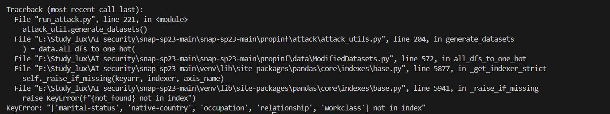

# SNAP: Efficient Extraction of Private Properties with Poisoning
**Authors: Harsh Chaudhari, John Abascal, Alina Oprea, Matthew Jagielski, Florian Tramèr, Jonathan Ullman.**

Code is implemented on this paper [SNAP: Efficient Extraction of Private Properties with Poisoning](https://arxiv.org/pdf/2208.12348.pdf)
This code is collected from the author's [SNAP repository](https://github.com/johnmath/snap-sp23/tree/main)

## Running the Model Confidence attack
This version of our attack obtains the model confidence from the target models for the distinguishing test. 
The following script modifies the training dataset, trains target and shadow models, runs the attack, and prints the results.
```shell
python run_attacks.py -dat [--dataset] -tp [--targetproperties] -t0 [--t0frac] -t1 [--t1frac] \
                      -sm [--shadowmodels] -p [--poisonlist] -d [--device] -fsub [--flagsub] \
                      -subcat [--subcategories] -q [--nqueries] -nt [--ntrials]

```
I also replicated the label-only extension on the property inference attack and the code was taken from this [branch](https://github.com/johnmath/snap-sp23/tree/label-only) of the previous repository. 
# Enhancements in the Code for Poisoning Attack Accuracy

### Overview
This section describes the modifications I made to the code to enhance its functionality. Initially, the provided codebase was set up to evaluate attack accuracy for a single poisoning rate. I extended its functionality to dynamically handle multiple poisoning rates for different property sizes, allowing for better evaluation and visualization. I also added the requirement.txt. Below is a detailed breakdown of the steps and enhancements made:

---

### Step 1: Setting Up the Environment
- I created a virtual environment and installed all the required packages.
- During the initial run, I also found an error regarding the command line argument. It was because, in the example section of their repository, they added '=' for assigning the argument value. So I analyzed how the argument was designed to take the value in the code and tried it without '='.
  

   
- I encountered a **TypeError** related to converting `numpy.ndarray` to `torch.Tensor`. The error traceback can be seen below:


So I looked for the file that was generating the modified dataset and added the argument (`dtype`=`float`) and ensured that all datasets were properly converted to supported data types (`float`) before creating `torch.Tensor`.


- Additionally, there was a **KeyError** indicating missing categorical columns in the dataset. I faced these errors because there was no proper mechanism for using the census dataset, so I made the possible adjustments  and verified and correctly defined the categorical and continuous columns used in the data preprocessing step. The corresponding traceback is shown below:



- The **KeyError** was addressed by verifying and correctly defining the categorical and continuous columns used in the data preprocessing step.
- After resolving these errors, the code was successfully executed, producing attack accuracy for a **single poisoning rate**.

---

### Step 2: Adding Support for Multiple Poisoning Rates and ploting
- I extended the code to handle **multiple poisoning rates** dynamically for different property sizes (e.g., small, medium, large). This was achieved by modifying the argument parser to accept a list of poisoning rates.
- I also modified the code so that it can plot the accuracy for different poison rates dynamically.
  
```python
parser.add_argument(
    '-p',
    '--poisonlist',
    help='list of poison percent',
    type=str,
    default="[0.0, 0.005, 0.01, 0.015, 0.02, 0.025, 0.03, 0.035, 0.04, 0.045, 0.05]"
) ```

 print("Attack Accuracy:")
    poisoning_rates = []
    accuracies = []

    for key in avg_success:
        print(f"{key*100:.2f}% Poisoning: {avg_success[key]}")
        poisoning_rates.append(key*100)
        accuracies.append(avg_success[key])
    
    # **Modified Section for Dynamic Plot**
    # Extract target properties
    target_properties = arguments["targetproperties"]
    # Multiply t0 and t1 fractions by 100
    t0_percentage = t0 * 100
    t1_percentage = t1 * 100
    

   # Determine the size of the property based on t0 and t1
    property_size = ""
    if t0 * 100 < 1 and t1 * 100 < 1:
        property_size = "small property"
    elif 1 <= t0 * 100 <= 9 or 1 <= t1 * 100 <= 9:
        property_size = "medium-sized property"
    else:
        property_size = "large, optimized property"

    # Dynamically create the title in the desired format
    target_properties_text = ", ".join([f"{prop[0].capitalize()} = {prop[1]}" for prop in target_properties])
    corner_title = (
        f"Target Properties ({property_size})\n"
        f"✱ {target_properties_text}; {t0_percentage:.1f}% vs {t1_percentage:.1f}%"
    )

    # **End of Modified Section**

    # Create the plot
    plt.figure(figsize=(10, 6))
    plt.plot(poisoning_rates, accuracies, marker='o', linestyle='--', label='Attack Accuracy')
    plt.xlabel('Poisoning Rate')
    plt.ylabel('Attack Accuracy')
    plt.title('Attack Accuracy vs. Poisoning Rate')
    plt.grid(True)
    plt.legend()

    # **Modified Section for Adding Corner Title**
    # Add the corner title dynamically
    plt.gcf().text(
        0.60, 0.2, corner_title, fontsize=10, bbox=dict(facecolor='white', alpha=0.8)
    )
    # **End of Modified Section**

    plt.show()
    
    
